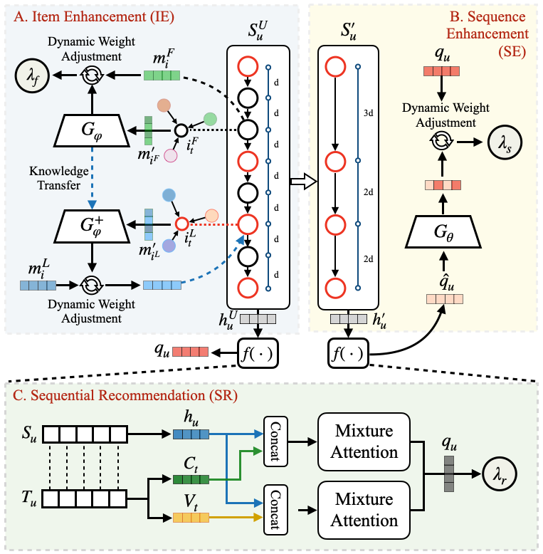

# UniRec: A Dual Enhancement of Uniformity and Frequency in Sequential Recommendations

This repository provides the code of experiments from the paper, which has been accepted by 33rd ACM International Conference on
Information and Knowledge Management (CIKM 2024). The paper is available online on [arXiv](https://arxiv.org/abs/2406.18470).

Our code structure is based on the [mojito](https://github.com/deezer/sigir23-mojito).

## Abstract
Representation learning in sequential recommendation is critical for accurately modeling user interaction patterns and improving recommendation precision. However, existing approaches predominantly emphasize item-to-item transitions, often neglecting the time intervals between interactions, which are closely related to behavior pattern changes. Additionally, broader interaction attributes, such as item frequency, are frequently overlooked. We found that both sequences with more uniform time intervals and items with higher frequency yield better prediction performance. Conversely, non-uniform sequences exacerbate user interest drift and less-frequent items are difficult to model due to sparse sampling, presenting unique challenges inadequately addressed by current methods. In this paper, we propose UniRec, a novel bidirectional enhancement sequential recommendation method. UniRec leverages sequence uniformity and item frequency to enhance performance, particularly improving the representation of non-uniform sequences and less-frequent items. These two branches mutually reinforce each other, driving comprehensive performance optimization in complex sequential recommendation scenarios. Additionally, we present a multidimensional time module to further enhance adaptability. To the best of our knowledge, UniRec is the first method to utilize the characteristics of uniformity and frequency for feature augmentation. Comparing with eleven advanced models across four datasets, we demonstrate that UniRec outperforms SOTA models significantly.
<p align="center">
  
</p>


## Environment Requirement

The code runs well under python 3.9.13. The required packages are as follows:

- Tensorflow-gpu==2.11.0
- numpy==1.24.2
- scipy==1.10.1
- pandas==1.5.3
- keras==2.11.0
- tqdm==4.65.0
- toolz==0.12.0
- tqdm==4.65.0

## Datasets

You need to download the following datasets:
- [ml-1m](https://grouplens.org/datasets/movielens/1m/)
- [Amazon Beauty](https://jmcauley.ucsd.edu/data/amazon/)
- [Amazon Books](https://jmcauley.ucsd.edu/data/amazon/)
- [Amazon Toys](https://jmcauley.ucsd.edu/data/amazon/)

Place the datasets in the following directory structure:
```
exp/data/
├── ml1m
├── beauty
├── books
└── toy
```

## Data Preprocessing

Before running the model, you need to preprocess the data. The preprocessing scripts are located in `exp/data/ml1m`.


## Running the Model

To quickly run the UniRec model, use the provided bash script:
```bash
bash run_unirec.sh
```

This script will execute the training and evaluation processes of the UniRec model.


## Hyperparameters
All hyperparameters are saved in the `/configs` directory.
